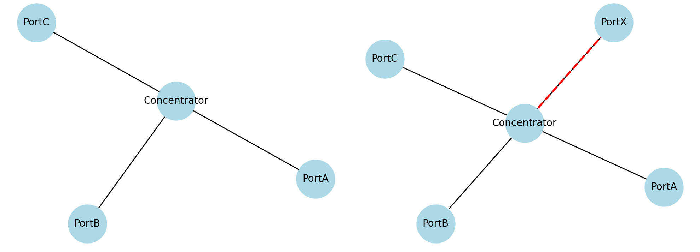
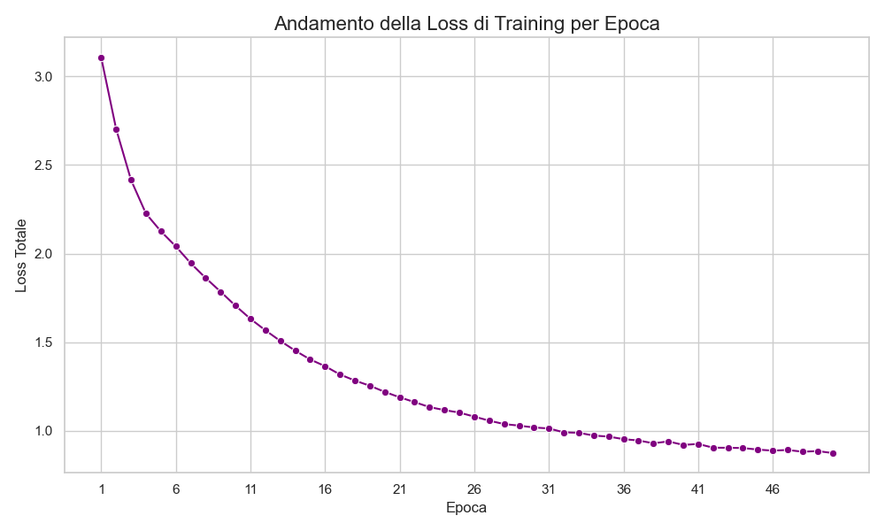
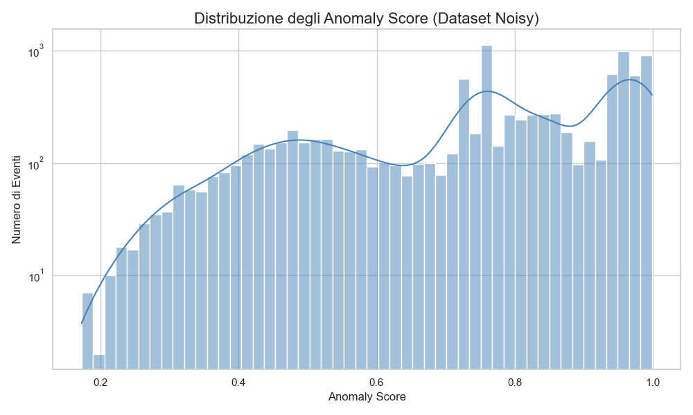
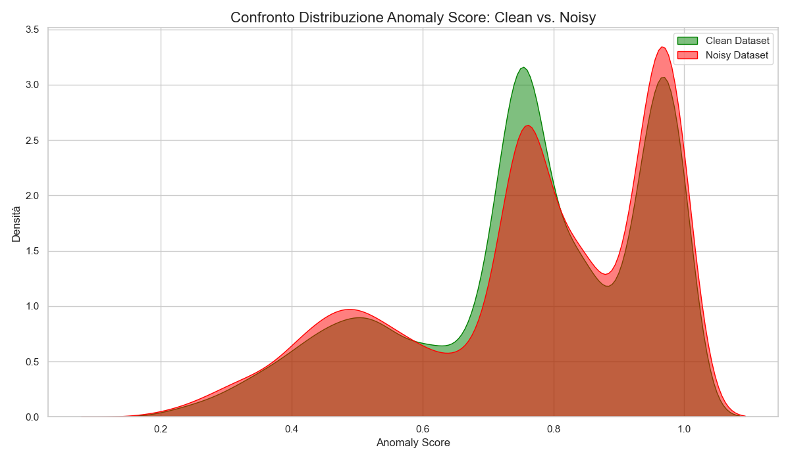
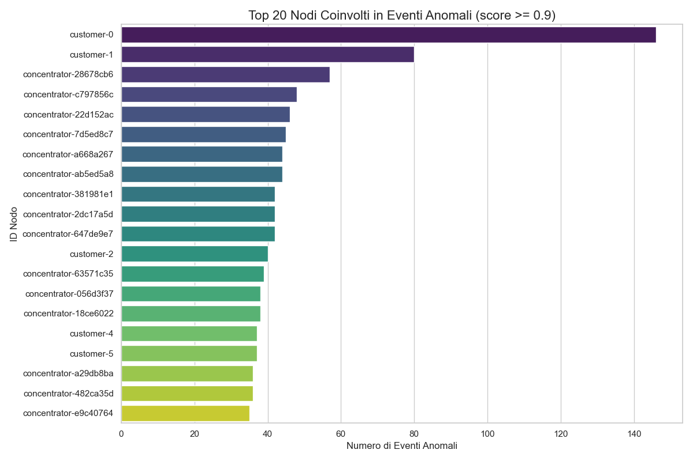
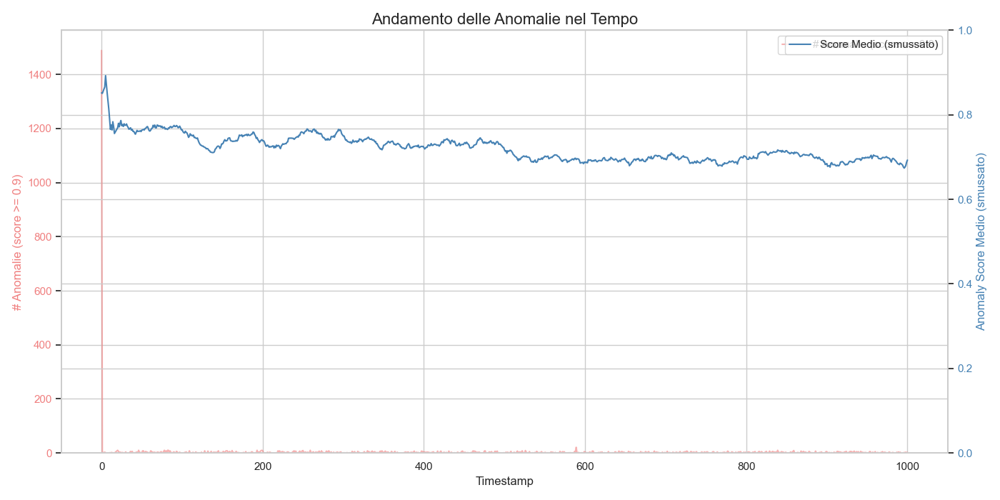

# Mine the Gap: Anomaly Detection in Dynamic Graphs with TGN

This project presents a robust solution for the "Mine the Gap" challenge, aimed at automatically detecting edge-level anomalies in a dynamic, evolving knowledge graph.

The core approach is to train a **Temporal Graph Network (TGN)** in an unsupervised fashion. The model learns the patterns of "normal" graph evolution from a clean dataset and then uses this knowledge to identify and score unexpected events in a noisy dataset.

## Available data
Two datasets are available, a `clean` one and a `noisy` one. The ``clean` one represents a dynamic knowledge graph, which is a data structure used to model relations between network entities across time. It represents a synthetic normal working network, simulated from Swisscom's probabilistic models. The `noisy` one is also synthetic but includes anomalies the graph's evolution.

Above is an example of event happening to the graph at a certain time. An extra port (X) connects to the concentrator vertex. If the concentrator vertex is usually only connected with Ports A, B and C, this could be an anomaly worthy of attention.

## Technical Approach

The solution is an end-to-end pipeline covering training, evaluation, and analysis:

1.  **Model Choice (TGN)**: We chose a Temporal Graph Network because it is specifically designed for dynamic graphs. Unlike static GNNs, TGNs maintain a memory for each node, allowing them to capture complex temporal dependencies and understand how the graph evolves over time.

2.  **Unsupervised Training**: In the absence of explicit anomaly labels, we trained the model on the `edge_events_clean.csv` dataset. The model's objective was link prediction: learning to predict the probability of an edge forming at a given time. This forces the model to develop a deep understanding of what constitutes a "normal" or expected graph event.

3.  **Anomaly Scoring**: The trained model assigns an `anomaly_score` to each event based on its predicted probability (`p_model`):
    *   For an `add` event: `anomaly_score = 1.0 - p_model`. An event is anomalous if the model considered it highly improbable.
    *   For a `remove` event: `anomaly_score = p_model`. An event is anomalous if the model was highly confident that the edge should have existed.

4.  **Evaluation Strategy**: To validate the model without a ground truth, we used two key metrics:
    *   **Internal Link Prediction**: We tested the model's ability to predict links on a held-out portion of the `clean` dataset. An **AUC score of 0.87** confirms the model successfully learned the underlying graph dynamics.
    *   **Dataset Diagnostics**: A crucial finding was that the `clean` and `noisy` datasets are **entirely disjoint** (no common events or even `(src, dst, label)` triplets). This discovery is critical for interpreting the results, as it implies the "noisy" data is not just a perturbed version of the clean data, but a completely different graph evolution.

## Results and Analysis

The pipeline produced a comprehensive set of metrics and visualizations, which allow for a deep analysis of the model's performance and the nature of the anomalies.

### 1. Training Performance: Learning Stability

*   **Observation**: The graph shows a smooth and consistent decrease in the training loss over 50 epochs, eventually converging to a stable, low value.
*   **Interpretation**: This is the primary indicator of a successful training process. The model effectively learned the temporal and structural patterns from the `clean` dataset without instability or erratic behavior. This builds confidence that its internal representation of "normality" is robust.

### 2. Anomaly Score Distribution (Noisy Dataset)

*   **Observation**: The distribution of anomaly scores on the `noisy` dataset is multi-modal, with a significant number of events receiving high scores ( > 0.7). The logarithmic y-axis highlights a long tail, but also shows that high-scoring events are not rare.
*   **Interpretation**: This is not a typical "rare anomaly" scenario. The model flags a large portion of the events in the `noisy` dataset as suspicious. This suggests that the deviations from the learned norm are widespread and systemic, rather than being a few isolated incidents.

### 3. Comparative Analysis: Clean vs. Noisy Scores

*   **Observation**: While both distributions share a similar shape, the `Noisy Dataset` (red) density plot is visibly shifted to the right, with a heavier concentration in the high-score region (> 0.8).
*   **Interpretation**: This is a key validation of our approach. The model consistently assigns higher anomaly scores to the `noisy` data compared to the `clean` data. This confirms that the model is sensitive to the perturbations and correctly identifies the `noisy` dataset as being more anomalous overall.

### 4. Root Cause Analysis: Identifying Key Problematic Nodes

*   **Observation**: The nodes `customer-0` and `customer-1` are involved in a vastly higher number of high-score anomalous events than any other node. The rest of the top 20 list is primarily composed of `concentrator` nodes.
*   **Interpretation**: This is the most actionable output of the entire pipeline. It provides a clear, prioritized list of entities for a network operator to investigate. The focus would immediately be on `customer-0` and `customer-1` to understand the root cause of the widespread anomalies associated with them. This demonstrates the model's practical utility in real-world scenarios.

### 5. Temporal Analysis: Anomaly Timeline

*   **Observation**: The number of high-score anomalies (red line, left axis) is low and sporadic after a large initial burst at `timestamp=0`. In contrast, the average anomaly score (blue line, right axis) remains consistently high throughout the timeline, hovering around 0.7-0.8.
*   **Interpretation**: The initial burst could represent a system initialization or a significant one-time event. The consistently high average score reinforces the finding that the `noisy` graph is fundamentally and persistently different from the `clean` one throughout its evolution, not just during specific "anomaly storms".

## Conclusion

The Temporal Graph Network model proved to be a highly effective tool for this challenge.

*   **Successes**:
    *   The model successfully **learned the complex dynamics** of the clean graph (AUC 0.87).
    *   It provides **clear, actionable insights** by identifying the most anomalous events and nodes (`customer-0`, `customer-1`).
    *   The analysis confirms that the model is **sensitive to the differences** between the clean and noisy datasets.

*   **Challenges & Key Findings**:
    *   The primary challenge was the nature of the dataset itself. The discovery that the `clean` and `noisy` datasets are **completely disjoint** made a standard quantitative evaluation of anomaly detection performance impossible.

Despite this limitation, the strong qualitative evidence and the robust internal validation metrics strongly suggest that the model is effective at identifying temporal and structural deviations in a dynamic graph.